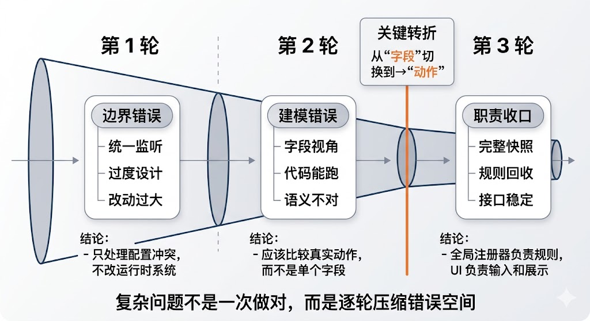
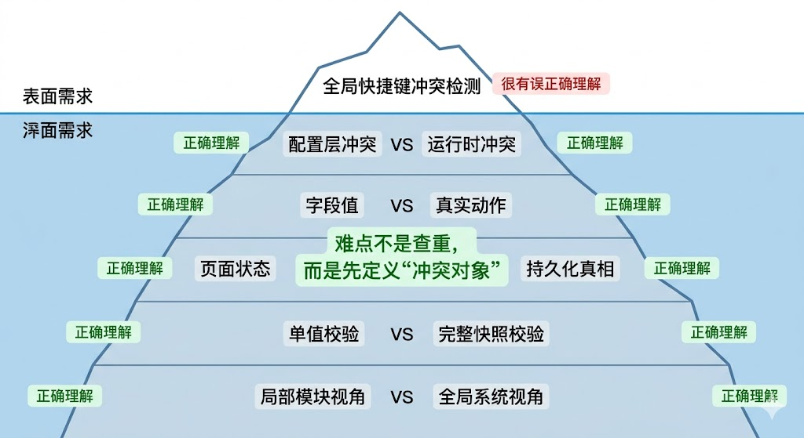
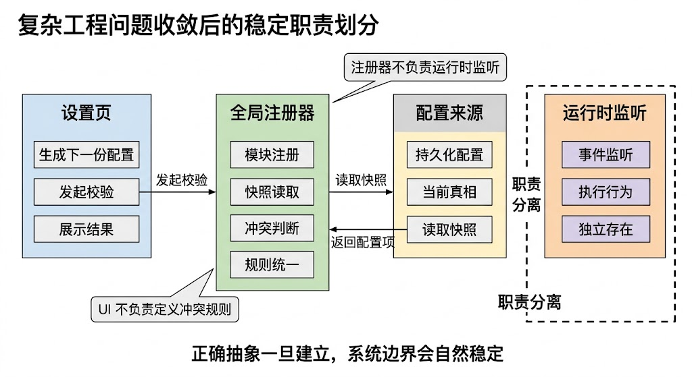

# 《复杂工程问题，为什么必须多轮收敛：一次 AI 协作实录》

> 这个需求看起来很简单：做一个全局快捷键冲突检测。
>
> 我让 AI 写了三轮。
>
> 第一轮：方案很优雅，但方向错了  
> 第二轮：代码能跑，但语义不对  
> 第三轮：才真正收敛到可用方案
>
> 这篇文章不讲代码，而是讲一个更重要的问题：
>
> 👉 为什么 AI 在复杂工程问题里，几乎不可能一次做对？

# 一、背景：为什么尝试用 AI 做这个需求

起点很普通：需要为一个前端系统补上“全局快捷键冲突检测”能力。用户可以自定义多个快捷键，系统要在保存配置时发现冲突，而不是等到运行时才暴露问题。

之所以用 AI，不是为了省掉工程判断，而是想验证它在复杂需求里的真实作用：它能不能快速给出正确抽象，并把实现一步推到位。

最初的预期也很典型：

- 帮忙拆解问题
- 给出一版合理设计
- 顺手完成主要实现
- 尽量减少来回讨论

结果很快证明，这类需求里 AI 的价值不在“一次做完”，而在“快速暴露错误前提”。

**结论：AI 适合加速复杂问题的收敛，不适合直接替代问题定义。**

# 二、问题本质

这个需求表面上是在做“键位查重”，本质上却是在回答一个更难的问题：系统到底应该以什么对象来判断冲突。

真正的分歧不在代码细节，而在这几层抽象：

- 冲突发生在配置层，还是运行时层
- 系统比较的是字段值，还是用户真正触发的动作
- 真相来源是当前页面状态，还是持久化配置
- 校验的是当前输入值，还是一次改动带来的整组配置结果
- 某个模块未加载时，它的配置是否仍然参与全局判断

一旦这些边界没切清楚，后面的实现再精致也只是“在错误模型上优化”。

**结论：复杂工程问题的难点通常不在实现，而在“先把冲突对象定义正确”。**

# 三、三次会话的演进过程

## 第一次会话：先切边界

目标很明确：建立一个全局快捷键能力。

AI 第一反应是做“统一热键中心”：

- 所有模块统一接管键盘监听
- 用一个中心处理作用域、优先级和冲突

这个方案很完整，也很诱人。但问题很快暴露出来：当前需求要解决的是“配置冲突”，不是“重写运行时热键系统”。一旦把两件事合并，改动面会急剧放大，已有行为也会进入回归区。

这一轮真正的收获不是代码，而是边界：

- 不改现有运行时监听
- 只做“全局快捷键配置注册器”

**结论：第一轮最重要的不是产出方案，而是把问题从“大重构”拉回到正确范围。**

## 第二次会话：从字段视角切到动作视角

第二轮开始进入实现层。AI 很自然地把各个配置字段直接注册到全局系统里，再做统一查重。

问题在这里：系统看到的是“字段”，用户触发的是“动作”。

在真实场景里，一个功能快捷键并不总是单键，它可能是组合键，也可能由多个配置共同决定。此时如果注册器只记录单个字段值，冲突判断看到的只是配置碎片，不是最终行为。

这一轮的关键修正有两个：

- 全局系统必须注册“真实动作”，不能只注册字段值
- 校验不能只看当前编辑项，而要基于下一份完整配置快照判断

这是第一次真正接近正确模型。

**结论：第二轮的核心进展，是让系统开始理解“真实动作”，而不是停留在配置字段层。**

## 第三次会话：把规则收回基础设施层

第三轮没有再加新能力，而是在清理前两轮残留的问题。

这时 AI 仍然会给出一些“看起来合理”的建议，比如：

- 只校验当前编辑值
- 让 UI 自己维护一套比较逻辑
- 把更多运行时状态塞进全局注册器

这些建议的问题在于：它们都在继续模糊职责。

最后收敛下来的做法是：

- 设置页仍然基于下一份完整配置生成临时快照
- 冲突判断统一交给全局注册器
- 排除当前模块等能力由注册器原生提供
- UI 只负责组织输入和展示结果，不再定义规则

这一步看起来只是“接口收口”，其实是整个方案稳定的关键。

**结论：第三轮真正完成的，不是功能补充，而是职责收口。**

# 四、关键转折点

真正的转折点只有一句话：

**系统判断的对象，必须是“真实动作”，不是“配置字段”。**

这句话一旦成立，后面的设计就自动收敛了：

- 为什么不能只看单个键值
- 为什么必须基于完整配置快照校验
- 为什么全局系统要理解组合行为
- 为什么规则不能散落在 UI 层

在这之前，讨论一直在“怎么查重”；在这之后，讨论才进入“到底在比较什么”。

这个转折之所以正确，是因为它直接修正了问题定义。问题定义一旦正确，代码实现反而会变简单。

**结论：复杂需求开始收敛的标志，不是代码写出来了，而是抽象终于对了。**

# 五、AI 在工程中的真实定位

这次过程给了我一个很明确的判断：AI 在工程里最适合做的是“高频试错与快速收敛”，不是“代替工程判断”。

它擅长的部分：

- 快速给出备选方案
- 推进局部实现
- 暴露抽象中的矛盾
- 加速重构和收口

它不擅长的部分：

- 一开始就定义对问题
- 天然理解业务语义之外的工程约束
- 稳定地区分“通用最佳实践”和“当前问题的正确边界”
- 在多层抽象交叉时一次命中

所以正确用法不是“把需求扔给 AI 等答案”，而是：

- 先让它生成候选抽象
- 再用多轮对话不断打掉错误前提
- 一旦发现边界错了，先修正模型，再继续写代码
- 最后把规则沉淀到稳定层，而不是留在页面逻辑里

**结论：AI 更像一个高带宽协作者，而不是自动驾驶系统。**

# 六、总结

如果重做一遍，这个需求完全可以更快，但前提不是“提示词更强”，而是从一开始就按正确顺序推进：

- 先切清配置层和运行时层
- 先定义真实冲突对象
- 先确认校验粒度是“完整快照”还是“单值”
- 再决定基础设施和 UI 的职责边界
- 最后才是实现细节

这次复盘最值得保留的，不是某个具体方案，而是一个更普遍的经验：

复杂工程问题之所以不能一次做对，不是因为 AI 不会写代码，而是因为这类问题的正确答案，本来就不是“生成出来”的，而是“收敛出来”的。

**结论：面对复杂问题，追求“一次答对”通常是错的，尽快进入“持续纠偏”的循环才是对的。**

# 附：复杂工程问题的收敛模型

这次过程其实可以抽象成一个通用模型：

1. 初始阶段：问题定义错误（看起来对，但抽象不对）
2. 中间阶段：在错误模型上不断优化
3. 转折点：识别出“真正的冲突对象”
4. 收敛阶段：围绕正确抽象快速推进
5. 稳定阶段：职责收口，规则统一

**结论：复杂工程问题不是线性求解，更像一轮轮压缩错误空间的过程。**

---

## 发布信息

- 发布日期：2026-03-19
- 更新日期：2026-03-19
