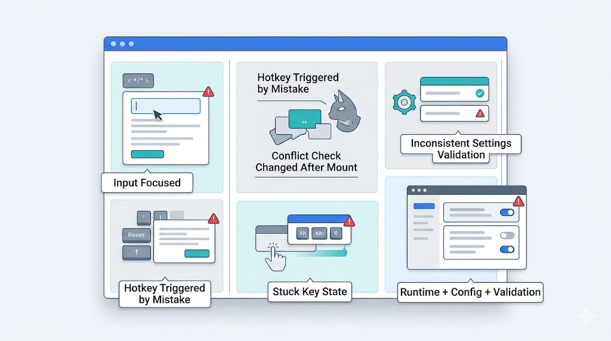
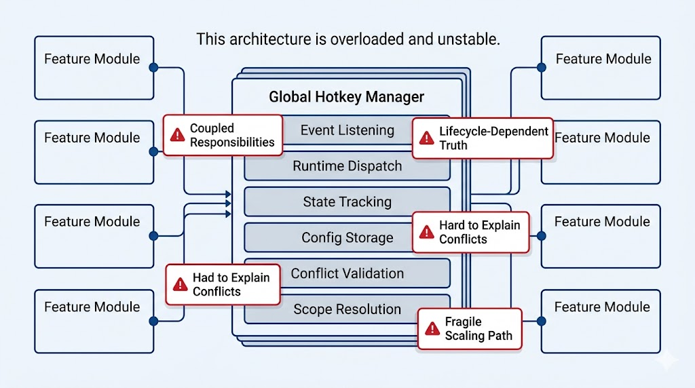
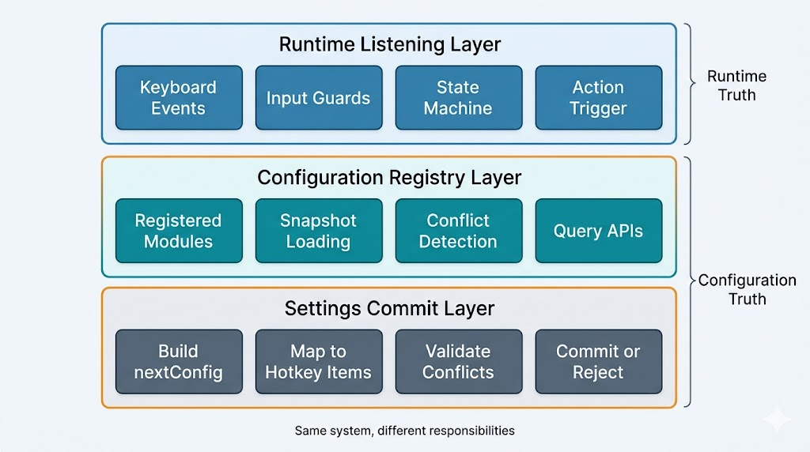
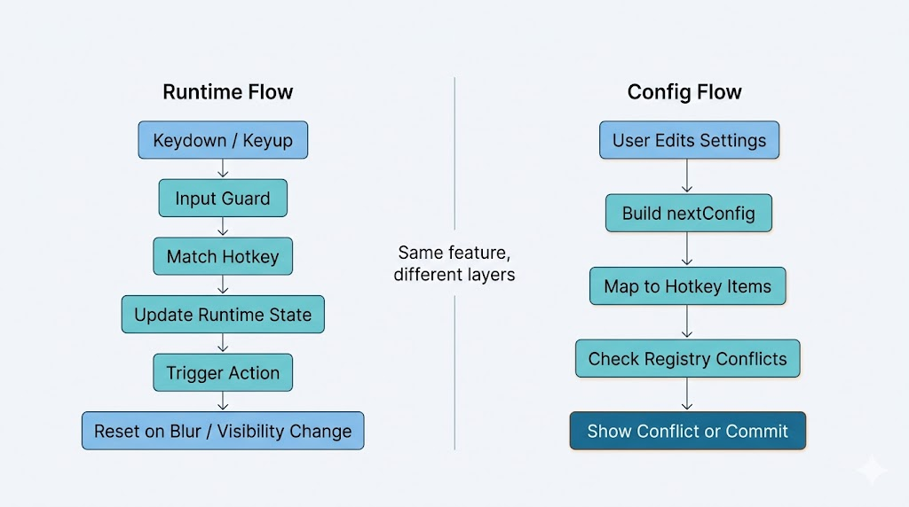

# React 全局快捷键系统设计：运行时监听、配置治理与提交校验分层

很多全局快捷键方案，一开始都很顺。

写一个 `keydown` 监听，匹配几个键位，触发对应动作，功能很快就能跑起来。真正的问题通常出现在第二阶段：

- 用户在输入框里打字，页面动作被误触发
- 设置页里修改一个键位，冲突提示忽有忽无
- 某个功能区域没渲染时，系统判定“没有冲突”；一旦渲染出来，同一套配置又变成冲突
- 页面失焦后，某个“按下中”的状态没有被清掉，回来以后交互表现异常

这时候就会发现，所谓“快捷键系统”，真正难的从来不是监听键盘事件。

难点在于三件事同时存在，而且经常被写在一起：

- 运行时如何监听和触发
- 配置层如何表达和存储
- 设置页如何做稳定的冲突校验

这篇文章讨论的，就是如何把这三层职责拆开，并给出一套适合 React 应用长期维护的设计方式。

我并不认为所有项目都需要一个统一的“快捷键框架”。但只要应用开始出现多功能区域、自定义键位、设置页、弹层交互或组合键，这个问题迟早会从“事件处理”升级成“架构边界”。



## 一、快捷键问题，为什么会从事件监听演变成架构问题

如果只看最小实现，快捷键似乎非常简单：

```ts
useGlobalHotkey({
  matcher: { type: "single", code: "KeyK" },
  onKeyDown: "trigger-action",
});
```

但真实工程里，事情很快就会变复杂。

第一类复杂度来自运行时：

- 需要区分 `keydown` 和 `keyup`
- 需要维护修饰键、前置键、组合键状态
- 需要处理 `blur`、`focus`、`visibilitychange`
- 需要避免输入框、编辑器、浏览器默认行为冲突

第二类复杂度来自配置层：

- 快捷键不再是代码常量，而是用户配置
- 一个配置变更可能联动改变多条快捷键
- 单键和组合键需要统一表达
- 不同功能区域共享同一套键位空间

第三类复杂度来自设置校验：

- 设置页看到的是“下一份配置”，而不是“当前已提交配置”
- 冲突判断必须稳定，不能依赖当前页面是否挂载某个组件
- 提示信息不能只告诉用户“冲突了”，还要能说清冲突对象

只要这三类问题被写进同一个 Hook、同一个组件、或者同一个“全局管理器”，系统就会迅速变得难以解释。

所以，快捷键系统的核心挑战不是“怎么监听”，而是“怎么拆职责”。

## 二、设计原则

在讲方案演进之前，先把我认为最重要的几条原则说清楚。

### 1. 配置真相独立于 UI 生命周期

快捷键配置属于应用级信息，不应该由某个组件是否挂载来决定是否存在。

如果某个功能区域没渲染时，它的快捷键就不参与冲突判断，那么冲突结果就依赖页面结构，而不是依赖已保存配置。这种系统在工程上是不稳定的。

### 2. 运行时调度与配置治理分离

运行时关心的是“按下以后触发什么”。

配置治理关心的是“这组定义能不能共存”。

这两个问题相关，但不属于同一层。如果把它们绑在一起，后续你会发现：改一个设置页提示，也得去碰全局事件调度。

### 3. 设置校验面向 `nextConfig`

设置页不是在编辑某个字段，而是在构造下一份配置。

这两件事看起来接近，实际上差很多。切模式、切前置键、恢复默认值，都会让整组快捷键发生联动变化。校验只盯当前字段，迟早会漏。

### 4. 输入态守卫统一收口

输入框、`textarea`、`contenteditable`、第三方编辑器，它们都属于“输入态”。

这层规则不能散落在不同模块里各写各的。否则今天拦 `input`，明天忘了拦富文本，后天又在另一个模块里重复实现一遍。

### 5. 优先级不应该污染配置层

“谁先响应”是运行时问题。

“能不能保存”是配置问题。

很多架构把 `scope`、`priority` 当成一套字段同时处理这两个问题，最后系统会越来越难解释。优先级可以有，但它应该属于运行时层。

## 三、常见方案为什么会把复杂度带偏

### 方案一：统一监听中心，所有问题都交给一个全局管理器

这通常是最容易想到的方案：全站只有一个监听器，所有模块向它注册快捷键和处理函数，由中心统一做匹配、优先级、作用域和触发。

这套方案的吸引力很大，因为它看起来足够完整。

但它的问题也很典型：太早、太重、太容易把问题混在一起。

如果当前最需要解决的是：

- 设置页冲突判断不稳定
- 多功能区域之间的键位冲突不可见
- 组件挂载导致结果变化

那么直接重做全站监听中心，往往是在错误的层面上发力。

它会带来这些成本：

- 改动面很大
- 需要重梳理已有交互链路
- 运行时仲裁规则会变成新复杂度来源
- 配置治理和事件调度被强耦合

统一监听中心并不是不能做，但它不适合作为第一步。很多团队的问题，不是监听不统一，而是配置真相没有被抽出来。

### 方案二：各模块维持现状，保存前临时拼一份“全量快捷键”做校验

这个方案比前一个轻得多：运行时保持不动，在设置页保存前，把所有模块的快捷键收集起来做一次冲突判断。

它的问题不在于能不能用，而在于会越来越散。

因为你很快会遇到这些问题：

- “全量快捷键”到底由谁来收集
- 一个模块没打开时，它是否应该参与判断
- 不同页面是不是会用不同方式组装同一份数据
- 新模块接入时，是不是又要复制一遍校验拼装逻辑

这个方案解决了“能判重”，但没有解决“系统里有哪些快捷键来源”。

一旦来源不稳定，所有判断都只能是阶段性的拼装结果，而不是系统级事实。

### 方案三：组件挂载时注册、卸载时注销

这种实现比纯工具函数更进一步，看起来已经有“全局服务”的样子了。组件挂载时注册当前快捷键，卸载时注销，配置变化时再更新服务里的缓存。

问题在于，这里缓存的依然不是应用配置，而是当前渲染树快照。

它最致命的缺点是：结果依赖组件生命周期。

这意味着：

- 某个功能区域没挂载时，它的快捷键仿佛不存在
- 页面路径不同，冲突结果可能不同
- 多标签页或外部配置修改后，内存缓存还可能过期

这类方案不是不能工作，而是不适合作为“配置真相来源”。



---

## 四、最终方案：运行时监听层、配置治理层、设置提交层

更稳的方式，是承认这是三个问题，然后分别处理。

### 1. 运行时监听层

这一层只管运行时行为：

- 注册和注销事件监听
- 处理组合键状态机
- 统一输入态守卫
- 处理 `blur`、`focus`、`visibilitychange`
- 命中后触发对应动作

它不回答“系统里有哪些快捷键配置”，也不负责“保存前是否冲突”。

### 2. 配置治理层

这一层通过一个注册器承担配置层职责：

- 模块声明自己有哪些快捷键配置项
- 注册器按需拉取各模块当前快照
- 快捷键值序列化后建立索引
- 提供冲突判断、快照查询、模块排除等能力

关键不在于“有一个注册器”，而在于模块注册的应该是“读取当前配置的方法”，不是“当前某个组件实例的状态”。

### 3. 设置提交层

设置页不要一边编辑一边写全局状态，而是统一走提交链路：

1. 基于旧配置生成 `nextConfig`
2. 从 `nextConfig` 映射出完整快捷键项集合
3. 与其他模块当前已保存配置进行比较
4. 只有通过校验，才真正提交

这层的价值非常大，因为它把“编辑中的临时态”和“系统已保存真相”彻底隔开了。

## 配图位置 3：最终分层架构图

> 建议插图：纵向三层结构图，分别是 `Runtime Listening Layer`、`Configuration Registry Layer`、`Settings Commit Layer`，并补充 `Runtime Truth` 与 `Configuration Truth` 的区分。



---

## 五、核心数据模型

如果想让这套设计具有复用价值，数据模型必须足够稳定。

### 1. `HotkeyValue`

```ts
type HotkeyValue =
  | {
      type: "single";
      code: string;
    }
  | {
      type: "combo";
      main: string[];
      modifiers?: Modifier[];
    };

type Modifier = "Meta" | "Ctrl" | "Alt" | "Shift";
```

这层建模解决两个问题：

- 单键和组合键使用统一表达方式
- 组合键用结构化数据表达，而不是用展示字符串做逻辑判断

### 2. `HotkeyItem`

```ts
type HotkeyItem = {
  id: string;
  module: string;
  label: string;
  getValue: () => HotkeyValue | null;
  getDefaultValue?: () => HotkeyValue | null;
};
```

这里我倾向于让 `value` 通过 `getValue()` 获取，而不是直接把值固化在注册项里。

原因很简单：注册器要拿到的是“当前快照”，而不是初始化时那一刻的旧值。

### 3. `ConflictResult`

```ts
type ConflictResult = {
  hasConflict: boolean;
  conflicts: Array<{
    value: HotkeyValue;
    items: HotkeyItem[];
  }>;
};
```

不是所有场景都需要完整结果，但建议设计时预留它。因为只要进入设置页，系统通常就需要知道：

- 哪个值冲突了
- 和哪些配置项冲突
- 如何生成更可读的提示信息

## 六、注册器接口设计

这一层不需要复杂，但要表达清楚边界。

```ts
type HotkeyRegistry = {
  registerModule(input: {
    module: string;
    getItems: () => HotkeyItem[];
  }): () => void;

  getItems(input?: {
    modules?: string[];
    excludeModules?: string[];
  }): HotkeyItem[];

  hasConflicts(input: {
    values: HotkeyValue | HotkeyValue[] | null;
    modules?: string[];
    excludeModules?: string[];
    excludeIds?: string[];
  }): boolean;

  getConflicts(input: {
    values: HotkeyValue | HotkeyValue[] | null;
    modules?: string[];
    excludeModules?: string[];
    excludeIds?: string[];
  }): ConflictResult;
};
```

这里有几个判断值得明确。

### `registerModule` 注册的是配置来源

这一点很关键。

如果注册的是“组件实例当前状态”，就会重新回到生命周期耦合的问题。注册器应该知道的是：这个模块如何给我一组当前配置项，而不是这个模块今天有没有被某个页面渲染出来。

### `excludeModules` 比 `excludeIds` 更适合设置页

设置页在做本模块校验时，真正的语义通常是“拿下一份配置和其他模块比”，而不是“排除当前模块里若干 id”。

模块排除比 id 排除更稳定，也更容易理解。

### `hasConflicts` 与 `getConflicts` 应该拆开

只关心“是否冲突”时，首个命中即可早停。

如果所有场景都走完整冲突收集，性能倒未必先出问题，但职责表达一定会变得含糊。

## 七、两条关键链路

这套方案真正落地，核心是两条链路要分清楚。

### 链路一：运行时触发链路

先看运行时层的 API 形态。

```ts
useGlobalHotkey({
  enabled: true,
  scope: "page",
  matcher: {
    type: "combo",
    main: ["KeyK"],
    modifiers: ["Meta"],
  },
  guard: "not-input-like-target",
  onKeyDown: "trigger-action",
  onKeyUp: "release-state",
  onReset: "clear-runtime-state",
});
```

这段伪代码已经足以说明几个运行时层必须承担的职责：

- 监听注册和清理
- 匹配器隔离
- 输入态守卫
- 状态重置兜底

### 链路二：设置提交链路

这一条链路更容易被低估，因为很多系统只在这里做了“字段级别校验”。

更稳的方式应该是：

```ts
commitHotkeyConfigChange({
  getNextConfig: (prevConfig) => nextConfig,
  validate: (nextConfig) => {
    const items = mapConfigToItems(nextConfig);

    return items.every(
      (item) =>
        !hotkeyRegistry.hasConflicts({
          values: item.getValue(),
          excludeModules: ["current-module"],
        }),
    );
  },
  onConflict: "show-conflict-feedback",
  onCommit: "persist-config",
});
```

这个写法的重点不是 API 形式，而是它表达了一条清晰边界：

- 设置页构造临时配置
- 临时配置映射成完整项集合
- 冲突判断只与“其他模块已保存配置”比较
- 通过校验后才进入真正提交

一旦这个边界不清晰，系统就很容易出现两种典型问题：

- 编辑中的中间状态污染全局
- 一次配置变更引发的联动冲突没有被完整识别



---

## 八、关键实现细节与踩坑

### 1. 输入态守卫必须有统一出口

输入态不是一个“看情况加一下”的判断，它应该是快捷键系统的基础设施。

建议至少统一成一个公共约定：

```ts
guard: "not-input-like-target";
```

覆盖范围通常包括：

- `input`
- `textarea`
- `contenteditable`
- 明确需要豁免的编辑器容器

这件事如果不统一，问题不会立刻出现，但一定会在后续某个新增功能里漏掉。

### 2. 不要假设 `keydown` 和 `keyup` 总能配对

用户切出窗口、浏览器拦截系统快捷键、标签页切后台，这些情况都会让状态机停在一个不完整状态里。

所以如果运行时层维护了“按下中”状态，就必须把 `blur`、`focus`、`visibilitychange` 视为状态重置点，而不是附加优化项。

### 3. 注册器不应该缓存编辑中的临时值

注册器的职责是反映已保存配置，而不是反映设置页正在编辑的草稿。

如果把临时值写进注册器，系统会失去“真相层”。其他页面读取到的就不再是稳定状态，而是某个局部编辑过程中的中间结果。

### 4. 序列化规则必须稳定

冲突判断最终都会落到“值比较”。

这并不意味着文章里需要展开具体实现，但架构上必须明确：单键和组合键都需要被归一化到一套稳定比较规则里，修饰键顺序、主键顺序和空值处理都必须有一致约定。

### 5. `scope` 不要过早承担过多语义

`scope` 是个很容易被滥用的字段。

很多系统希望它同时处理：

- 页面级隔离
- 弹层覆盖
- 运行时优先级
- 配置冲突豁免

这种做法的后果通常是：字段名没问题，语义越来越混乱。

更实际的做法是：

- 配置层先处理模块维度和排除规则
- 运行时层再单独设计 scope 激活和优先级仲裁

## 九、边界声明

这套方案解决的是：

- React 应用中的全局快捷键配置治理
- 运行时监听与配置校验的职责拆分
- 设置页基于 `nextConfig` 的稳定校验
- 多功能模块之间的统一注册与冲突查询

这套方案不展开以下问题：

- 跨窗口、跨标签页、跨 iframe 的同步
- 操作系统保留快捷键的兼容处理
- 富文本编辑器、代码编辑器的内部命令系统
- 完整的无障碍键盘导航体系
- 面向不同平台输入法差异的细粒度适配

这些问题都存在，但它们不属于同一层架构问题。把它们强行揉进同一个方案，只会让边界越来越模糊。

## 十、后续演进方向

如果这三层已经稳定下来，后续可以继续往下走，但前提是不要打破边界。

### 1. 运行时优先级系统

当页面级、弹层级、局部区域级快捷键同时存在时，可以在运行时层继续引入：

- `scope`
- `priority`
- `activeScopeStack`

这能解决“谁先执行”的问题，但不应该反向影响配置层的冲突定义。

### 2. 更细粒度的冲突策略

本文默认的是“完全相等即冲突”。

如果场景需要，后续可以扩展为：

- 前缀冲突
- 子集冲突
- 同作用域冲突、跨作用域允许共存

但这类扩展必须建立在规则可解释的前提上。用户不怕规则严格，怕的是规则说不清。

### 3. 插件式接入

一旦注册器足够稳定，新功能模块可以按统一协议接入：

```ts
hotkeyRegistry.registerModule({
  module: "plugin-module",
  getItems: () => pluginItems,
});
```

这时候宿主系统不需要理解插件内部细节，只需要理解它暴露出来的配置快照。

## 十一、总结

全局快捷键系统最容易犯的错误，是把所有问题都当成事件监听问题。

一旦问题这样定义，系统就会朝着“更大的监听器、更重的全局中心、更复杂的作用域规则”一路演化。看起来越来越完整，实际上越来越难维护。

我更倾向于把它拆成三层：

- 运行时监听层，负责触发
- 配置治理层，负责定义
- 设置提交层，负责校验和提交

这套拆法的价值，不在于“更抽象”，而在于它让几个关键判断重新稳定下来：

- 配置真相不再依赖组件挂载
- 设置校验不再只盯单个字段
- 运行时优先级不再污染配置层
- 编辑中的临时态不会污染系统真相

如果要把本文压缩成几句能被单独传播的结论，我会保留这三句：

- 快捷键系统失控，往往不是监听写错了，而是职责没有拆开。
- 配置真相不能依赖 UI 生命周期，这是一条架构底线。
- 设置页校验必须面向 `nextConfig`，否则联动冲突迟早会漏。

对于复杂 React 应用，这不是唯一解法，但它是一条足够稳的起点。

---

## 发布信息

- 发布日期：2026-03-19
- 更新日期：2026-03-19
